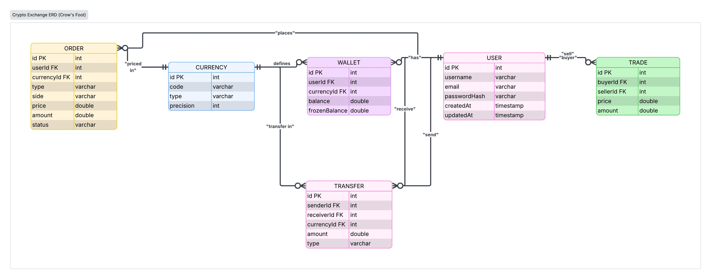

#  C2C Crypto Exchange — Backend API

A backend service powering a peer-to-peer (C2C) cryptocurrency exchange. Handles wallets, orders, and internal transfers with transactional integrity at the database level.

Built on **Node.js + Express**, backed by **PostgreSQL via Supabase**, with **Prisma ORM** as the data layer.

---

## ⚠️ For Reviewers

For security reasons, credentials have been **removed/masked** in the following files:

- `.env`
- `package.json`
- `src/seed.js`
- `src/app.js`

**Please use the credentials sent to you via email** and insert them into the files above before running the project. Without them, you will not be able to connect to the database or run the server.

---

## Stack

| Layer | Choice |
|---|---|
| Runtime | Node.js |
| Framework | Express.js |
| Database | PostgreSQL (Supabase) |
| ORM | Prisma Client |
| DB Driver | `pg` (node-postgres) + `@prisma/adapter-pg` |

---

## ER Diagram



---

## Getting Started

### 1. Install dependencies

```bash
npm install
```

### 2. Configure environment

Create a `.env` file in the project root:

```env
DATABASE_URL="postgresql://<user>:<password>@<host>:6543/postgres?pgbouncer=true"
PORT=3000
```

> Grab the connection string from your Supabase project settings (`Database → Connection string → Transaction pooler`). Never commit the real `.env` file.
>
> **Note:** The actual credentials for `.env`, `package.json`, `seed.js`, and `app.js` have been sent via email. Please replace the masked values in the code with them before running the project.

### 3. Generate the Prisma Client

```bash
npx prisma generate
```

### 4. Seed the database

Populates core currencies (`THB`, `USD`, `BTC`, `ETH`, `XRP`, `DOGE`), mock users, and starting wallet balances.

```bash
npx prisma db seed
```

### 5. Run the server

```bash
node src/app.js
```

Server boots at **http://localhost:3000**

---

## API Reference

### Wallets

**`GET /api/wallets/:userId`**
Returns all wallets belonging to a user, joined with their currency definitions.

---

### Orders

**`POST /api/orders`**
Places a limit order. Validates available balance, deducts it, and moves the equivalent amount into `frozen` — all inside a single DB transaction so partial failures can't leave balances inconsistent.

```json
{
  "userId": 2,
  "currencyId": 1,
  "type": "LIMIT",
  "side": "BUY",
  "amount": 0.05,
  "price": 10000
}
```

---

### Transfers

**`POST /api/transfers`**
Moves funds between two users' wallets. Sender debit and receiver credit happen atomically in an isolated transaction — either both succeed or neither does.

```json
{
  "senderId": 2,
  "receiverId": 1,
  "currencyId": 3,
  "amount": 0.01
}
```

---

## Troubleshooting

### GET request returns `[]` even after seeding

If you've run `npx prisma db seed` and `node src/app.js` successfully, but calling an endpoint via Postman returns an empty `[]`, check the data directly through one of the following methods:

**Prisma Studio**

```bash
npx prisma studio
```

This opens a data management UI at `http://localhost:5555`, where you can inspect the `User`, `Wallet`, and `Currency` tables to confirm whether the seed data actually exists — and edit or add records directly from there if needed.

---

## Notes

- All balance-mutating endpoints (orders, transfers) run inside Prisma `$transaction` blocks to prevent race conditions on concurrent requests.
- Currency and user seed data lives in the Prisma seed script — adjust it there if you need different test fixtures.